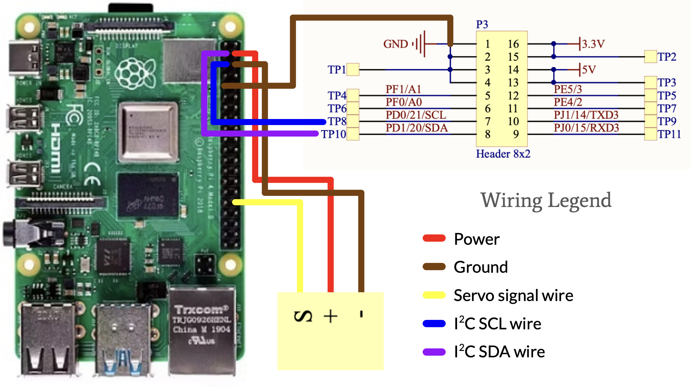
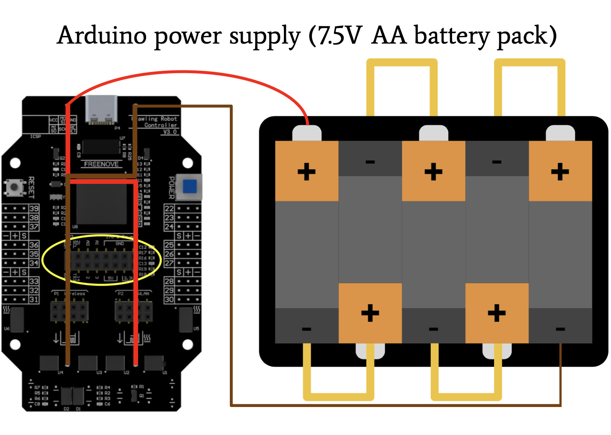
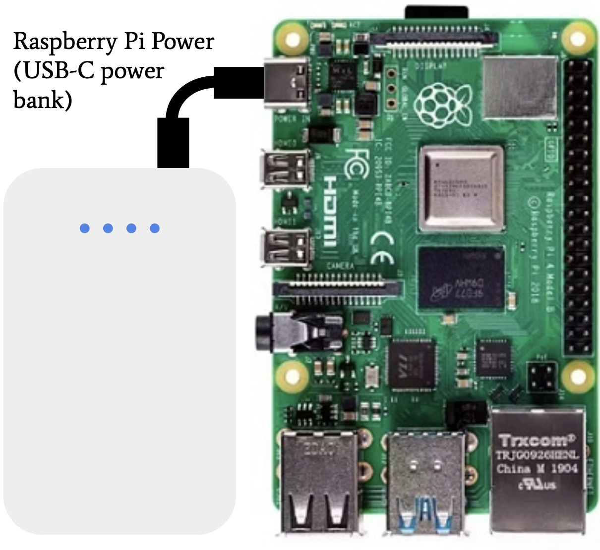
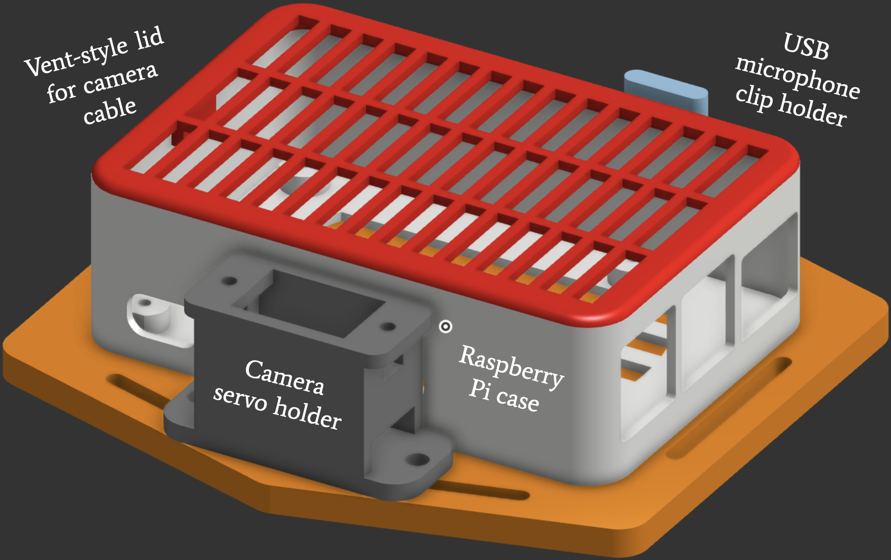

# Hexapod
My project is a six-legged contraption that uses servos to move around. The legs have multiple joints using a total of 18 servos. These work in conjunction with each other using inverse kinematics to calculate where to position them to most effectively walk in a direction. It can be commanded wirelessly using a remote control equipped with a joystick, potentiometers, and a few buttons. The hexapod is equipped with a USB webcam and a Raspberry Pi capable of image processing to provide live feedback, in addition to a microphone to listen for human input. All together, the hexapod can be commanded by voice to walk in 4 directions, and it can be told to locate and walk towards an AprilTag by turning the camera servo. By far the most difficult challenge throughout this journey was making the inverse kinematics algorithm. I found out the mathematical relationships between the servo angles and a point in 3D space relatively quickly, but debugging it was incredibly hard due to the amount of terms in each equation. The second hardest but most demotivating challenge was solving the issue of weight. I was able to make the legs more vertical to reduce the torque on them, but this increased instability by raising the center of mass.

| **Engineer** | **School** | **Area of Interest** | **Grade** |
|:--:|:--:|:--:|:--:|
| Jeremy P | Oakwood School | Electrical Engineering | Incoming Senior


# Modifications

<iframe width="560" height="315" src="https://www.youtube.com/embed/RK8BhdVMe1Q?si=tss6djTaYyS-v5wC" title="YouTube video player" frameborder="0" allow="accelerometer; autoplay; clipboard-write; encrypted-media; gyroscope; picture-in-picture; web-share" referrerpolicy="strict-origin-when-cross-origin" allowfullscreen></iframe>
Once I had each of the subsystems/devices tested, I could add them to my hexapod. In total, the modifications include a USB speaker, a USB microphone, a Raspberry Pi camera mounted on a servo, a Raspberry Pi 4 Model B, a USB-C power bank for the Raspberry Pi, and a 3D printed housing to hold everything on the hexapod.

I found a 3D model for a case that holds my Raspberry Pi. Its lid uses a relatively loose snap-fit joint that can easily be taken on and off, and I modified their design to allow for my wires and the camera flex cable to be connected to the Raspberry Pi. I also designed a hexagonal platform for the case to sit on and initially included long, flat pillars to fit into the hexapod chassis. However, I learned that designing things to fit exactly as I intend is never realistic, so I snapped off those pillars and instead used metal standoffs with M3 screws that fit into the chassis. This not only left much more room for error, but also holds the platform with much more strength. I designed a servo holder and a stand for the microphone to clip on as well, and these are both fastened to the platform. Also on the platform is the 7.5V AA battery pack that powers the Arduino. I used zip ties to keep all of the wires and cables tidy. The Pi is powered by a power bank on the bottom of the robot, which is held there using double-sided tape and zip ties.

Using the microphone, speaker, and camera in conjunction, I can use my voice to command the hexapod to walk in a direction I want. I use a list of words that can mean forward, backward, right, and left, and using a communication protocol called I2C, I can send values from the Raspberry Pi to the Arduino, and the Arduino can set the speed and direction to whatever I want. So if I want the hexapod to walk left, I can say "left" or "west" or "portside", and it will walk at pi radians. I can also say "locate," and once I confirm with the system by saying "positive", it will start the AprilTag location sequence. The servo goes to its counterclockwise limit and starts sweeping clockwise until it sees the AprilTag, and then slowly approaches the tag until it's in the center of the camera's vision. Once that is done, the Raspberry Pi sends an I2C command to the Arduino containing the value of the camera's angle, and makes the hexapod walk towards the AprilTag.

I made the speaker multilingual since my family and I can speak multiple languages, and I wanted to give it a try just for fun. When I'm personally speaking, the microphone can understand English and Spanish the best, since those are the two languages I am familiar with. Any other language I attempt to speak may not see favorable results.

A challenge that I've faced since adding these modifications is weight. My original walking algorithm had the shoulder servos point straight outwards, which maximizes the lever arm of the force that the hexapod applies to each leg. In other words, it provided an unreasonable amount of torque for the legs to manage, and it would buckle under weight. To fix this, I altered my legs' base positions to be much lower on the z-axis, which made the legs taller. With the legs taller, the lever arm is much smaller, so the amount of torque the servos have to handle is much less. This in turn let the hexapod walk while sacrificing instability, since the center of mass is elevated.

In the future, I want to make the language interpreter much more widespread and effective. To do this, I want to connect the Raspberry Pi to a local server running a version of AI that can understand a plethora of languages, understand commands that stray from one set phrase ("move left" as opposed to "walk left" and vice versa), and generate more effective responses.

# Third Milestone

<iframe width="560" height="315" src="https://www.youtube.com/embed/cCnKeUiYuPs?si=JeaXOo3PYhKB-K7G" title="YouTube video player" frameborder="0" allow="accelerometer; autoplay; clipboard-write; encrypted-media; gyroscope; picture-in-picture; web-share" referrerpolicy="strict-origin-when-cross-origin" allowfullscreen></iframe>
My third milestone includes my work on all the extra devices I added to my project. In total, there are three main additions: a USB speaker, a USB microphone, and a Raspberry Pi camera. Each of these devices is supported by and runs on a Raspberry Pi 4 Model B.

I connected to the Raspberry Pi Desktop using Virtual Network Computing, which allowed me to run Python code on it and access things like the GPIO pins, the USB inputs, and power. Initially, I used prerecorded audio files to play on the speaker, which is how I fine-tuned the volume. I realized quickly that if I wanted the speaker to respond accurately to certain inputs from the microphone, prerecording responses wasn't going to be very efficient, so I imported Google Translate into my python environment. To ensure that what the microphone hears is what a person actually said, I added a safety check that says, "Did you say, {phrase}?"

The microphone was one of the biggest challenges I encountered throughout this project. Besides getting familiar with the documentation of the speech recognition package I used, constant incorrect results and infinite feedback loops between the speaker and the microphone proved difficult adversities. The way I manage each subsystem/device uses background threads to enable them to run simultaneously. This allows the microphone to be listening as the speaker is speaking, which would cause both devices to slingshot back and forth for a while. I solved this by just pausing all function on the Pi for 2 seconds. In the future, I hope to add more advanced technologies such as echo cancellation to much more efficiently solve this issue.

I've worked with computer vision before, so working with the camera was a bit easier than the microphone. I use a software that recognizes a type of QR code called an AprilTag. This software handles the complex calculations to get the translational and rotational vectors of the tag from the camera. All I had to do was calibrate the camera to find its focal length, which is necessary for the calculations. To calibrate the camera, I took a bunch of pictures of a chessboard from all different distances and angles, and used a Python edge-detection script that found the points on the chessboard and mapped the 3D points in real life to the 2D points on the camera's video.

# Second Milestone

<iframe width="560" height="315" src="https://www.youtube.com/embed/AKbBMT0cKrQ?si=8zjm9QAUEI72863R" title="YouTube video player" frameborder="0" allow="accelerometer; autoplay; clipboard-write; encrypted-media; gyroscope; picture-in-picture; web-share" referrerpolicy="strict-origin-when-cross-origin" allowfullscreen></iframe>
My second milestone was enabling the hexapod to walk in any direction. After two weeks of calculations, I've successfully created adjustable settings to customize the gait, including speed, stride, direction, and how much each leg sinks into the floor while walking.

At first, I tried driving each leg based on its potential to do work in the direction of movement. I did this by calculating the dot product of the direction vector with each base servo's direction of movement, as well as each elbow servo's (they are perpendicular, which made me assume that I could achieve any direction). This proved quite ineffective, most likely because each servo traced an arc on the ground rather than a linear path for the most direct push.

After that, I pivoted to real 3 DOF inverse kinematics. Using the law of cosines, I derived each servo's angle in radians based on a point in (x,y,z) space. With this relationship, I could request a point in space for the tip of the leg to be at, and by mapping pulse widths in microseconds to a 0-180 degree (0-PI/2 radians) range, each servo would adjust to the correct angle to position the tip of the leg at the desired point. Then, I used linear interpolation to continuously drive each servo in the opposite direction of movement, so that they would push in that direction. When they are not pushing, they return to the start position in a sinusoidal motion.

# First Milestone

<iframe width="560" height="315" src="https://www.youtube.com/embed/l4NmR7XJLtE?si=4x3Q3vZmPOnKehZ1" title="YouTube video player" frameborder="0" allow="accelerometer; autoplay; clipboard-write; encrypted-media; gyroscope; picture-in-picture; web-share" referrerpolicy="strict-origin-when-cross-origin" allowfullscreen></iframe>
My first milestone was completing the mechanical assembly of the hexapod. It has 6 legs, each with 3 servos used for a base, a shoulder, and an elbow. I can run code that uses these servos in conjunction to move the robot forward. It can move itself forward on 6 legs, mimicking the way an ant walks, or it can crab walk (walking on the four corner legs while holding up its two middle legs). It can also sit and wave its two middle arms.

I faced challenges configuring the servos to their home positions, but I circumvented this issue by attaching the servo attachments to the servo horns at appropriate angles while they were powered. With this, the servos move to their appropriate positions within a small margin of error.

Currently, I'm facing challenges with the power provided to the servos. With the USB cable connected to my laptop, the servos move at the correct speed. Without it, the servos move a tiny amount every couple of seconds. I need to reexamine the schematic to see why this is happening. After that, I'll get some other basic movement functions operating, and then I can start adding my modifications.

I hope to add a camera and a Raspberry Pi processor that can send commands to the Arduino microcontroller, i.e. waving when the camera recognizes a human or a pet dog. Additionally, I would like to add a speaker, a microphone, and an LED display, so that the robot has more stimuli and responses. I'll calculate the required voltage for each of these modifications and see whether my current batteries source enough current for all of them to run simultaneously.

# Starter Project

<iframe width="560" height="315" src="https://www.youtube.com/embed/AjJmskXgcbA?si=TMgxeei5rKUD7gwA" title="YouTube video player" frameborder="0" allow="accelerometer; autoplay; clipboard-write; encrypted-media; gyroscope; picture-in-picture; web-share" referrerpolicy="strict-origin-when-cross-origin" allowfullscreen></iframe>
I built the Retro Arcade Console as my starter project. I soldered most of the components to the board besides the microcontroller, like the electrolytic capacitor, the LED grid and score displays, the power switch, and the buttons.

# Schematics





# Code
<!--
Here's where you'll put your code. The syntax below places it into a block of code. Follow the guide [here]([url](https://www.markdownguide.org/extended-syntax/)) to learn how to customize it to your project needs. 
-->
Hexapod Code
```c++
#ifndef ARDUINO_AVR_MEGA2560
#error Wrong board. Please choose "Arduino/Genuino Mega or Mega 2560"
#endif

// libraries
#include <Servo.h>
#include <SoftwareSerial.h>
#include <math.h>

#include <SPI.h>
#include <nRF24L01.h>
#include <RF24.h>

#include <Wire.h>
#define ARDUINO_ADDRESS 0x08

// radio for remote control, address same as the one acknolwedged in code on remote control
RF24 radio(9, 53); // CE, CSN
const byte address[6] = "00001";

// list of Servo objects for all 18 servos (plus a blank one for easy numbering)
Servo base[7];
Servo shoulder[7];
Servo elbow[7];

// servo power enable pins (built-in)
const int servoPowerEnableGroup1 = A15;
const int servoPowerEnableGroup2 = A14;

// servo pins
const int base_pins[7] = {0, 22, 25, 28, 39, 36, 33};
const int shoulder_pins[7] = {0, 23, 26, 29, 38, 35, 32};
const int elbow_pins[7] = {0, 24, 27, 30, 37, 34, 31};

// lifting and standing groups
const int group1[3] = {1, 3, 5};
const int group2[3] = {2, 4, 6};

// base sign for which direction is positive
const int base_signs[7] = {0, 1, 1, 1, -1, -1, -1};

// the microsecond value of each servo's home position (1472 according to angle mapping)
const int base_angle_us = 1500;
const int shoulder_angle_us = 1500;
const int elbow_angle_us = 1500;

// joystick values
float joystickX = 0.0;
float joystickY = 0.0;
int joystickZ = 0;

// where the robot wants to move
float direction = 0.0;
// how fast the legs move
float speed = 0.0;
// how far the leg goes to move
float maxStride = 0.1;
// how high the leg goes in z when returning to step again
const float returnLiftHeight = -0.5;
// how low into the ground the desired z should be when pushing
float z_depression = -0.1;

// phase used to keep track of which tripod to be pushing and which to be swinging
float phase = 0.0;
// max amount of time incremented per loop
float maxDt = 0.02;
// turning amount (positive = ccw, negative = cw)
float turnAmount = 0.0;

// length of first joint
const float b = 55.0 / 70.0;
// length of second joint
const float c = 1.0;

// angles at which each leg is mounted relative to the horizontal (measured in degrees)
const int legMountAngle[7] = {0, 34, 6, -25, 147, 176, -150};

// each leg's home position in xyz space
const float base_x[7] = {0.0, b * cos(radians(legMountAngle[1])), b * cos(radians(legMountAngle[2])), b * cos(radians(legMountAngle[3])), b * cos(radians(legMountAngle[4])), b * cos(radians(legMountAngle[5])), b * cos(radians(legMountAngle[6]))};
const float base_y[7] = {0.0, b * sin(radians(legMountAngle[1])), b * sin(radians(legMountAngle[2])), b * sin(radians(legMountAngle[3])), b * sin(radians(legMountAngle[4])), b * sin(radians(legMountAngle[5])), b * sin(radians(legMountAngle[6]))};
const float base_z[7] = {0.0, 0.0, 0.0, 0.0, 0.0, 0.0, 0.0};

// only used in forward kinematics calculations {
float theta_base[7] = {legMountAngle[0], legMountAngle[1], legMountAngle[2], legMountAngle[3], legMountAngle[4], legMountAngle[5], legMountAngle[6]};
float theta_shoulder[7] = {0.0, 0.0, 0.0, 0.0, 0.0, 0.0, 0.0};
float theta_elbow[7] = {0.0, 0.0, 0.0, 0.0, 0.0, 0.0, 0.0};

float x_from_thetas(int legIndex) {
    return cos(theta_base[legIndex]) * (b * cos(theta_shoulder[legIndex]) + c * sin(theta_shoulder[legIndex] + theta_elbow[legIndex]));
}
float y_from_thetas(int legIndex) {
    return sin(theta_base[legIndex]) * (b * cos(theta_shoulder[legIndex]) + c * sin(theta_shoulder[legIndex] + theta_elbow[legIndex]));
}
float z_from_thetas(int legIndex) {
    return b * sin(theta_shoulder[legIndex]) - c * cos(theta_shoulder[legIndex] + theta_elbow[legIndex]);
}
//}

// helper function for mapping radians to a pulse width
float mapThetaToUs(float theta) {
    return (theta / PI) * (2400 - 544) + 544;
}

// used to put all legs at their home position
void homeAll() {
    for (int i = 1; i <= 6; i++) {
        base[i].writeMicroseconds(base_angle_us);
        shoulder[i].writeMicroseconds(shoulder_angle_us + 700 * base_signs[i]);
        elbow[i].writeMicroseconds(elbow_angle_us + 700 * base_signs[i]);
    }
}

// a data type to store the 3 angles for a given leg
struct LegThetas {
    float base;
    float shoulder;
    float elbow;
};

// inverse kinematics function that takes a desired point in xyz and returns appropriate angles for each a leg's servos
LegThetas calculateLegThetas(int legIndex, float desired_x, float desired_y, float desired_z);
LegThetas calculateLegThetas(int legIndex, float desired_x, float desired_y, float desired_z) {
    LegThetas result;
    float x = desired_x;
    float y = desired_y;
    float z = desired_z;

    result.base = atan2(y, x);

    float r = sqrt(x * x + y * y);
    float d = sqrt(r * r + z * z);
    float alpha = atan2(z, r);
    float C = acos(constrain((b * b + d * d - c * c) / (2 * b * d), -1.0, 1.0));
    result.shoulder = alpha + C;

    float D = acos(constrain((b * b + c * c - d * d) / (2 * b * c), -1.0, 1.0));
    result.elbow = D - PI / 2 - 0.75;

    return result;
}

// function that commands a leg's servos to their intended angles
void writeLeg(int legIndex, LegThetas t);
void writeLeg(int legIndex, LegThetas t) {
    float localBase = t.base - radians(legMountAngle[legIndex]);
    if (legIndex < 4) {
        base[legIndex].writeMicroseconds(mapThetaToUs(localBase + PI / 2));
        shoulder[legIndex].writeMicroseconds(mapThetaToUs(t.shoulder + PI / 2));
        elbow[legIndex].writeMicroseconds(mapThetaToUs(PI - (t.elbow + PI / 2)));
    } else {
        base[legIndex].writeMicroseconds(mapThetaToUs(PI - (localBase + PI / 2)));
        shoulder[legIndex].writeMicroseconds(mapThetaToUs(PI - (t.shoulder + PI / 2)));
        elbow[legIndex].writeMicroseconds(mapThetaToUs(t.elbow + PI / 2));
    }
}

// main walking algorithm
void walkDirection(float direction, float phase, float stride) {
    float x, y, z, time, offset;
    bool stance;
    LegThetas t;
    for (int i = 1; i <= 6; i++) {
        // phase < 0.5: ground/pushing stage for tripod1, lifting stage for tripod2
        // phase >= 0.5: ground/pushing stage for tripod2, lifting stage for tripod1
        stance = (phase < 0.5);
        time = stance ? (phase / 0.5) : ((phase - 0.5) / 0.5);
        
        if ((i % 2 == 1) != stance) { // swing back
            offset = stride * (-2.0 * time + 1.0);
            z = base_z[i] + returnLiftHeight * sin(PI * time) - z_depression;
        } else { // stand and push
            offset = stride * (2.0 * time - 1.0);
            z = base_z[i] - z_depression;
        }

        x = base_x[i] + offset * cos(direction);
        y = base_y[i] + offset * sin(direction);

        t = calculateLegThetas(i, x, y, z);
        writeLeg(i, t);
    }
}

// simple turning functions that run indefinitely

float turnStart;
int turnStep = 0;
void turn(int direction) { // 1 for right -1 for left
    if (turnStart < millis()) {
        turnStart = millis() + 200;
        turnStep = (turnStep + 1) % 8;
    }
    
    const int* liftGroup;
    const int* standGroup;

    liftGroup = turnStep < 4 ? group1 : group2;
    standGroup = turnStep < 4 ? group2 : group1;

    switch (turnStep % 4) {
        case 0:
            for (int i = 0; i < 3; i++) {
                base[standGroup[i]].writeMicroseconds(1500);
                shoulder[standGroup[i]].writeMicroseconds(1500);
                shoulder[liftGroup[i]].writeMicroseconds(1500 - 200 * base_signs[liftGroup[i]]);
            }
            break;
        case 1:
            for (int i = 0; i < 3; i++) {
                bool rightSide = liftGroup[i] <= 3;
                int us;

                if (direction > 0) {
                    if (rightSide) {
                        us = 1100;
                    } else {
                        us = 1900;
                    }
                } else {
                    if (rightSide) {
                        us = 1900;
                    } else {
                        us = 1100;
                    }
                }

                base[liftGroup[i]].writeMicroseconds(us);
            }
            break;
        case 2:
            for (int i = 0; i < 3; i++) {
                shoulder[liftGroup[i]].writeMicroseconds(1500 + 200 * base_signs[liftGroup[i]]);
            }
            break;
        case 3:
            for (int i = 0; i < 3; i++) {
                bool rightSide = liftGroup[i] <= 3;
                int us;

                if (direction > 0) {
                    if (rightSide) {
                        us = 1900;
                    } else {
                        us = 1100;
                    }
                } else {
                    if (rightSide) {
                        us = 1100;
                    } else {
                        us = 1900;
                    }
                }

                base[liftGroup[i]].writeMicroseconds(us);
            }
            break;
    }
}

// handles I2C transactions (the Arduino has no reason to transmit, so it basically only receives)
byte data_to_echo = 0;
bool startRecording = false;
String payload = "";

void receiveData(int bytecount) {
    for (int i = 0; i < bytecount; i++) {
        data_to_echo = Wire.read();

        if (data_to_echo == 0x67 || data_to_echo == 0x00 || data_to_echo == 0x01) {
            startRecording = true;
            Serial.print("Ack byte: 0x");
            Serial.println(data_to_echo, HEX);
        } else if (startRecording) {
            payload += (char) data_to_echo;
            Serial.println((char) data_to_echo);
        }
    }

    if (payload.equals("STP")) {
        speed = 0.0;
    } else if (payload.equals("FWD")) {
        direction = 1.57;
        speed = 0.5;
    } else if (payload.equals("BCK")) {
        direction = -1.57;
        speed = 0.5;
    } else if (payload.equals("WRT")) {
        direction = 0.0;
        speed = 0.5;
    } else if (payload.equals("WLT")) {
        direction = 3.14;
        speed = 0.5;
    }/* else if (payload.equals("TRT")) {
        direction = (int)((PI / 2) * 100) / 100.0;
    } else if (payload.equals("TLT")) {
        direction = (int)((PI / 2) * 100) / 100.0;
    }*/

    if (payload.charAt(0) == '0' || payload.charAt(0) == '1') {
        Serial.println("decoded direction");
        direction = (payload.substring(1).toFloat() / 180.0) * PI * (payload.charAt(0) == 1 ? 1 : -1);
        speed = 0.5;
    }

    startRecording = false;
    payload = "";
}
void sendData() {
    Wire.write(data_to_echo);
}

// setup (called once)
void setup() {
    pinMode(servoPowerEnableGroup1, OUTPUT);
    digitalWrite(servoPowerEnableGroup1, HIGH);
    pinMode(servoPowerEnableGroup2, OUTPUT);
    digitalWrite(servoPowerEnableGroup2, HIGH);
    //pinMode(LED_BUILTIN, OUTPUT);

    for (int i = 1; i <= 6; i++) {
        base[i].attach(base_pins[i]);
        shoulder[i].attach(shoulder_pins[i]);
        elbow[i].attach(elbow_pins[i]);
    }

    homeAll();
    delay(1000);

    Serial.begin(9600);

    while (!Serial) {
        ;
    }

    radio.begin();
    radio.openReadingPipe(0, address);
    radio.setPALevel(RF24_PA_MIN);
    radio.startListening();
    //port.begin(115200);

    Wire.begin(ARDUINO_ADDRESS);
    Wire.onReceive(receiveData);
    Wire.onRequest(sendData);
}

// loop (iterated over and over)
void loop() {
    if (radio.available()) {
        char text[16] = "";
        radio.read(&text, sizeof(text));
        String line = String(text);
        line.trim(); //removes white space from joystick input
        Serial.println(line);
        
        int separatorIndex = line.indexOf(":");
        if (separatorIndex != -1) {
            String label = line.substring(0, separatorIndex);
            float value = line.substring(separatorIndex + 1).toFloat();

            if (label.equals("joystickX")) {
                joystickX = value;
                speed = 1.0;
                Serial.println(joystickX);
            } else if (label.equals("joystickY")) {
                joystickY = value;
                speed = 1.0;
                Serial.println(joystickY);
            } else if (label.equals("joystickZ")) {
                //joystickZ = value;
                speed = 0;
                Serial.println(speed);
            }

            // if (label.equals("joystickX") || label.equals("joystickY")) {
            //     speed = constrain(hypot(joystickX - 512, joystickY - 512) / 512.0, 0.0, 1.0);
            // }
        }
    }
    if (Serial.available()) {
        String line = Serial.readStringUntil("\n");
        line.trim(); //removes white space from joystick input
        Serial.println(line);
        
        int separatorIndex = line.indexOf(":");
        if (separatorIndex != -1) {
            String label = line.substring(0, separatorIndex);
            float value = line.substring(separatorIndex + 1).toFloat();

            if (label.equals("direction")) {
                direction = value;
                Serial.print("direction: ");
                Serial.println(direction);
            } else if (label.equals("speed")) {
                speed = constrain(value, 0, 1);
                Serial.print("speed: ");
                Serial.println(speed);
            } else if (label.equals("stride")) {
                maxStride = constrain(value, 0, 1);
                Serial.print("stride: ");
                Serial.println(maxStride);
            } else if (label.equals("dt")) {
                maxDt = constrain(value, 0, 0.1);
                Serial.print("dt: ");
                Serial.println(maxDt);
            } else if (label.equals("z_depression")) {
                z_depression = constrain(value, -0.5, 0.5);
                Serial.print("z_depression: ");
                Serial.println(z_depression);
            } else if (label.equals("turn_amount")) {
                turnAmount = constrain(value, -0.1, 0.1);
                Serial.print("turn_amount: ");
                Serial.println(turnAmount);
            }

            // if (label.equals("joystickX") || label.equals("joystickY")) {
            //     speed = constrain(hypot(joystickX - 512, joystickY - 512) / 512.0, 0.0, 1.0);
            // }
        }
    }

    if (speed > 0.001) {
        //direction = atan2(joystickY - 512, joystickX - 512);
        
        walkDirection(direction, phase, maxStride * speed);
        
        direction += turnAmount;
    } else {
        homeAll();
        delay(200);
    }

    phase += maxDt * speed;
    if (phase >= 1.0) {
        phase -= 1.0;
    }
}
```

Remote Control Code
```c++
/*
 * Sketch     Self diagnosis sketch for Remote
 * Platform   Freenove Smart Car Remote (Compatible with Arduino Uno) with 
 *            Freenove Smart Car Remote Shield and Freenove Control Board
 * Brief      This sketch is used to diagnose the remote after it has been assembled.
 *            If your remote is not working properly, follow the steps below to diagnose and fix.
 * Steps      1. Install NRF24L01 module to the remote.
 *            2. Connect remote to computer via USB cable and choose the right board and port.
 *               Then open Serial Moniter with baud 115200.
 *            4. Upolad this sketch to the remote.
 *               The Serial Moniter will show diagnostic information. 
 *               Operate the remote and the Serial Moniter will show relevant information.
 *            5. Please check the diagnostic information and try to fix the problem.
 *               Then press the RESET button to run this sketch again to see if the problem has been fixed.
 *               If yes, please upload the default sketch again to verify if the remote is working properly.
 *               If no or you can't fix the problem, please send diagnostic information and how did the 
 *               remote behave to our support team (support@freenove.com).
 * Author     Ethan Pan @ Freenove (support@freenove.com)
 * Date       2021/01/15
 * Version    V12.0
 * Copyright  Copyright © Freenove (http://www.freenove.com)
 * License    Creative Commons Attribution ShareAlike 3.0
 *            (http://creativecommons.org/licenses/by-sa/3.0/legalcode)
 * -----------------------------------------------------------------------------------------------*/

#ifndef ARDUINO_AVR_UNO
#error Wrong board. Please choose "Arduino Uno"
#endif

#include <SPI.h>
#include "RF24.h"
#include <FlexiTimer2.h>

RF24 radio = RF24(9, 10);

const byte address[6] = "00001";

bool resetX = false;
bool resetY = false;

enum InputPin { Pot1, Pot2, JoystickX, JoystickY, JoystickZ, S1, S2, S3, None };

const int pot1Pin = A0,         // define POT1
          pot2Pin = A1,         // define POT2
          joystickXPin = A2,    // define pin for direction X of joystick
          joystickYPin = A3,    // define pin for direction Y of joystick
          joystickZPin = 7,     // define pin for direction Z of joystick
          s1Pin = 4,            // define pin for S1
          s2Pin = 3,            // define pin for S2
          s3Pin = 2,            // define pin for S3
          led1Pin = 6,          // define pin for LED1 which is close to POT1 and used to indicate the state of POT1
          led2Pin = 5,          // define pin for LED2 which is close to POT2 and used to indicate the state of POT2
          led3Pin = 8;          // define pin for LED3 which is close to NRF24L01 and used to indicate the state of NRF24L01

volatile int ledState = 1;

void setup() {
  Serial.begin(115200);
  Serial.println("");
  Serial.println("");
  Serial.println("Freenove Smart Car Remote Shield and Freenove Control Board");
  Serial.println("------------------------------------------------------------------------------------------");

  pinMode(joystickZPin, INPUT);
  pinMode(s1Pin, INPUT);
  pinMode(s2Pin, INPUT);
  pinMode(s2Pin, INPUT);
  pinMode(led1Pin, OUTPUT);
  pinMode(led2Pin, OUTPUT);
  pinMode(led3Pin, OUTPUT);

  FlexiTimer2::set(200, UpdateService);
  FlexiTimer2::start();

  pinMode(12, INPUT_PULLUP);
  
  radio.begin();
  radio.openWritingPipe(address);
  radio.setPALevel(RF24_PA_MIN);
  radio.stopListening();

  Serial.println("------------------------------------------------------------------------------------------");
  Serial.println("Please start to operate the remote...");
}

void loop() {
  int pot1Value = analogRead(pot1Pin);
  int pot2Value = analogRead(pot2Pin);
  int joystickXValue = analogRead(joystickXPin);
  int joystickYValue = analogRead(joystickYPin);
  bool joystickZValue = digitalRead(joystickZPin);
  bool s1Value = digitalRead(s1Pin);
  bool s2Value = digitalRead(s2Pin);
  bool s3Value = digitalRead(s3Pin);

  static int pot1ValueBefore = pot1Value;
  static int pot2ValueBefore = pot2Value;
  static int joystickXValueBefore = joystickXValue;
  static int joystickYValueBefore = joystickYValue;
  static bool joystickZValueBefore = joystickZValue;
  static bool s1ValueBefore = s1Value;
  static bool s2ValueBefore = s2Value;
  static bool s3ValueBefore = s3Value;

  static InputPin inputPin = InputPin::None;
  static InputPin inputPinBefore = inputPin;

  static int printCounter = 0;
  const int maxPrintCount = 15;

  const int potIgnoredLength = 8;

  if(abs(pot1Value - pot1ValueBefore) > potIgnoredLength) {
    /*
    if(inputPin != InputPin::Pot1) {
      inputPin = InputPin::Pot1;
      Serial.println("");
      Serial.print("Pot1: ");
    }
    pot1ValueBefore = pot1Value;
    Serial.print(pot1Value);
    Serial.print(", ");
    printCounter++;
    */
    pot1ValueBefore = pot1Value;

    char text[16];
    snprintf(text, sizeof(text), "pot1Value:%d", pot1Value);
    radio.write(&text, sizeof(text));
    Serial.print("pot1: ");
    Serial.println(pot1Value);
    delay(50);
  }

  if(abs(pot2Value - pot2ValueBefore) > potIgnoredLength) {
    /*
    if(inputPin != InputPin::Pot2) {
      inputPin = InputPin::Pot2;
      Serial.println("");
      Serial.print("Pot2: ");
    }
    pot2ValueBefore = pot2Value;
    Serial.print(pot2Value);
    Serial.print(", ");
    printCounter++;
    */
    pot2ValueBefore = pot2Value;

    char text[16];
    snprintf(text, sizeof(text), "pot2Value:%d", pot2Value);
    radio.write(&text, sizeof(text));
    Serial.print("pot2: ");
    Serial.println(pot2Value);
    delay(50);
  }

  if(abs(joystickXValue - joystickXValueBefore) > potIgnoredLength) {
    /*
    if(inputPin != InputPin::JoystickX) {
      inputPin = InputPin::JoystickX;
      Serial.println("");
      Serial.print("JoystickX: ");
    }
    joystickXValueBefore = joystickXValue;
    Serial.print(joystickXValue);
    Serial.print(", ");
    printCounter++;
    */
    joystickXValueBefore = joystickXValue;

    char text[16];
    snprintf(text, sizeof(text), "joystickX:%d", joystickXValue);
    radio.write(&text, sizeof(text));

    Serial.print("x: ");
    Serial.println(joystickXValue);

    resetX = false;

    delay(50);
  } else {
    if (!resetX) {
      joystickYValueBefore = joystickYValue;

      char text[16];
      snprintf(text, sizeof(text), "joystickX:%d", 512);
      radio.write(&text, sizeof(text));

      Serial.println("x: 512");

      resetX = true;

      delay(50);
    }
  }

  if(abs(joystickYValue - joystickYValueBefore) > potIgnoredLength) {
    /*
    if(inputPin != InputPin::JoystickY) {
      inputPin = InputPin::JoystickY;
      Serial.println("");
      Serial.print("JoystickY: ");
    }
    joystickYValueBefore = joystickYValue;
    Serial.print(joystickYValue);
    Serial.print(", ");
    printCounter++;
    */
    joystickYValueBefore = joystickYValue;

    char text[16];
    snprintf(text, sizeof(text), "joystickY:%d", joystickYValue);
    radio.write(&text, sizeof(text));

    Serial.print("y: ");
    Serial.println(joystickYValue);

    resetY = false;

    delay(50);
  } else {
    if (!resetY) {
      joystickYValueBefore = joystickYValue;

      char text[16];
      snprintf(text, sizeof(text), "joystickY:%d", 512);
      radio.write(&text, sizeof(text));

      Serial.println("y: 512");

      resetY = true;

      delay(50);
    }
  }

  if(joystickZValue != joystickZValueBefore) {
    delay(10);
    /*
    if(joystickZValue != joystickZValueBefore) {
      if(inputPin != InputPin::JoystickZ) {
        inputPin = InputPin::JoystickZ;
        Serial.println("");
        Serial.print("JoystickZ: ");
      }
      joystickZValueBefore = joystickZValue;
      Serial.print(joystickZValue);
      Serial.print(", ");
      printCounter++;
    }
    */
    joystickZValueBefore = joystickZValue;

    char text[16];
    snprintf(text, sizeof(text), "joystickZ:%d", joystickZValue);
    radio.write(&text, sizeof(text));
    Serial.print("z: ");
    Serial.println(joystickZValue);
    delay(50);
  }

  if(s1Value != s1ValueBefore) {
    delay(10);
    /*
    if(s1Value != s1ValueBefore) {
      if(inputPin != InputPin::S1) {
        inputPin = InputPin::S1;
        Serial.println("");
        Serial.print("S1: ");
      }
      s1ValueBefore = s1Value;
      Serial.print(s1Value);
      Serial.print(", ");
      printCounter++;
    }
    */
    s1ValueBefore = s1Value;

    char text[16];
    snprintf(text, sizeof(text), "s1Value:%d", s1Value);
    radio.write(&text, sizeof(text));
    Serial.print("s1: ");
    Serial.println(s1Value);
    delay(50);
  }

  if(s2Value != s2ValueBefore) {
    delay(10);
    /*
    if(s2Value != s2ValueBefore) {
      if(inputPin != InputPin::S2) {
        inputPin = InputPin::S2;
        Serial.println("");
        Serial.print("S2: ");
      }
      s2ValueBefore = s2Value;
      Serial.print(s2Value);
      Serial.print(", ");
      printCounter++;
    }
    */
    s2ValueBefore = s2Value;

    char text[16];
    snprintf(text, sizeof(text), "s2Value:%d", s2Value);
    radio.write(&text, sizeof(text));
    Serial.print("s2: ");
    Serial.println(s2Value);
    delay(50);
  }

  if(s3Value != s3ValueBefore) {
    delay(10);
    /*
    if(s3Value != s3ValueBefore) {
      if(inputPin != InputPin::S3) {
        inputPin = InputPin::S3;
        Serial.println("");
        Serial.print("S3: ");
      }
      s3ValueBefore = s3Value;
      Serial.print(s3Value);
      Serial.print(", ");
      printCounter++;
    }
    */
    s3ValueBefore = s3Value;

    char text[16];
    snprintf(text, sizeof(text), "s3Value:%d", s3Value);
    radio.write(&text, sizeof(text));
    Serial.print("s3: ");
    Serial.println(s3Value);
    delay(50);
  }

  /*
  if(inputPin != inputPinBefore) {
    printCounter = 0;
  }
  inputPinBefore = inputPin;
  
  if(printCounter >= maxPrintCount) {
    Serial.println("");
    Serial.print("    ");
    printCounter = 0;
  }
  */

  analogWrite(led1Pin, map(analogRead(pot1Pin), 0, 1023, 0, 255));
  analogWrite(led2Pin, map(analogRead(pot2Pin), 0, 1023, 0, 255));
}


void UpdateService()
{
  sei();

  UpdateStateLED();
}

void UpdateStateLED()
{
  const static int stepLength = 2;
  const static int intervalSteps = 3;
  static int ledState = ::ledState;
  static int counter = 0;

  if (counter / stepLength < abs(ledState))
  {
    if (counter % stepLength == 0)
      SetStateLed(ledState > 0 ? HIGH : LOW);
    else if (counter % stepLength == stepLength / 2)
      SetStateLed(ledState > 0 ? LOW : HIGH);
  }

  counter++;

  if (counter / stepLength >= abs(ledState) + intervalSteps)
  {
    ledState = ::ledState;
    counter = 0;
  }
}

void SetStateLed(bool state)
{
  digitalWrite(led3Pin, state);
}
```

Raspberry Pi - tts.py
```python
import time
from gtts import gTTS
from io import BytesIO
from pydub import AudioSegment
from deep_translator import GoogleTranslator
import pygame

class TTS:
    def __init__(self, main, boost):
        self.main = main
        self.phrase = None
        self.mp3_fp = None
        self.tts = None
        self.segment = None
        self.boost = boost
        if self.boost > 10:
            print("Do not add more than 10 dB!")
            self.boost = 10
        self.boosted = None
        self.final = None
        self.phrase_requested = False
        self.is_speaking = False
        
        self.allowed_languages = {
            "english": 'en',
            "spanish": 'es',
            "filipino": 'tl',
            "french": 'fr',
            "japanese": 'ja',
            "dutch": 'nl',
            "german": 'de',
            "vietnamese": 'vi',
            "chinese": 'zh-CN',
            "arabic": 'ar'
        };
        self.language = 'en'

    def get_mp3_bytes(self, phrase, boost):
        self.mp3_fp = BytesIO()
        self.tts = gTTS(text=GoogleTranslator(source='en', target=self.language).translate(phrase), lang=self.language)
        self.tts.write_to_fp(self.mp3_fp)
        self.mp3_fp.seek(0)

        self.segment = AudioSegment.from_mp3(self.mp3_fp)
        self.boosted = self.segment + self.boost
        self.final = BytesIO()
        self.boosted.export(self.final, format="mp3")

        return self.final

    def play_phrase(self, phrase, boost=10):
        self.is_speaking = True
        
        pygame.mixer.init()
        pygame.mixer.music.load(self.get_mp3_bytes(phrase, boost))
        pygame.mixer.music.play()
        while pygame.mixer.music.get_busy():
            pygame.time.wait(100);
        
        time.sleep(2)
        self.is_speaking = False
    
    def bark(self):
        self.is_speaking = True
        
        pygame.mixer.init()
        pygame.mixer.music.load("/home/compoundmaster/hexapod_project/dragon-studio-free-dog-bark-419014.mp3")
        pygame.mixer.music.play()
        while pygame.mixer.music.get_busy():
            pygame.time.wait(100);
        
        time.sleep(2)
        self.is_speaking = False

    def request_phrase(self, phrase):
        self.phrase = phrase
        self.phrase_requested = True

    def run(self):
        while self.main.running:
            if self.phrase_requested:
                self.play_phrase(self.phrase)
                
                self.phrase_requested = False
            else:
                time.sleep(0.2)
```

Raspberry Pi - mic.py
```python
import time
import speech_recognition as sr
from deep_translator import GoogleTranslator

class Mic:
    def __init__(self, main):
        self.main = main
        self.r = sr.Recognizer()
        self.recognized_text = None
        self.potential_command = None
        self.stop_listening = None

    def set_language(self, language):
        if language == next((k for k, v in self.main.tts.allowed_languages.items()
                             if v == self.main.tts.language), None):
            self.main.tts.request_phrase(
                "Language is already " +
                GoogleTranslator(source='en', target=self.main.tts.language).translate(language) +
                "."
            )
        else:
            self.main.tts.language = self.main.tts.allowed_languages[language]
            self.main.tts.request_phrase(
                "Set language to " +
                GoogleTranslator(source='en', target=self.main.tts.language).translate(language) +
                "."
            )

    def parse_speech(self, txt):
        if txt is None:
            return
        
        txt = txt.lower()

        if txt == "positive":
            if self.potential_command is not None:
                if self.potential_command == "locate":
                    self.main.cam.request_scan_for_tag()
                    self.main.tts.request_phrase("Requested April Tag location sequence.")
                else:
                    self.main.i2c.request_set_command(self.potential_command)
                    print("requested i2c set command")
                    self.main.tts.request_phrase("Sent command, " + self.potential_command + ".")
                self.potential_command = None
            else:
                self.main.tts.request_phrase("Indeed.")

        elif txt == "negative":
            if self.potential_command is not None:
                self.main.tts.request_phrase("Okay, please repeat the command.")
                self.potential_command = None
            else:
                self.main.tts.request_phrase("What are you even saying no to?")

        elif txt in {"english","spanish","filipino","french","japanese","dutch","german","vietnamese","chinese","arabic"}:
            self.set_language(txt)
        
        elif txt == "good boy":
            self.main.tts.bark()
        
        else:
            self.potential_command = txt
            self.main.tts.request_phrase("Did you say, " + txt + "?")
            print("Did you say, {}?".format(txt))

    def callback(self, recognizer, audio):
        if self.main.tts.is_speaking is True:
            print("not recognizing speech")
            return
        
        try:
            # recognize in the current language
            text = GoogleTranslator(source=self.main.tts.language, target='en').translate(recognizer.recognize_google(audio, language=self.main.tts.language))
            print("parsed:", text)
            self.parse_speech(text)
        except sr.UnknownValueError:
            self.main.tts.request_phrase("Sorry, could you repeat that?")
            print("repeat")
        except sr.RequestError as e:
            print("API error:", e)

    def run(self):
        source = sr.Microphone(device_index=1)
        
        with source:
            self.r.adjust_for_ambient_noise(source, duration=1)
        
        self.r.energy_threshold = 1000
        self.r.dynamic_energy_threshold = True
        
        self.stop_listening = self.r.listen_in_background(source, self.callback)
        
        while self.main.running:
            time.sleep(0.2)
        
        self.stop_listening(wait_for_stop=True)
```

Raspberry Pi - i2c.py
```python
import time
from smbus2 import SMBus

class I2C:
    def __init__(self, main):
        self.main = main
        self.arduino_address = 0x08
        self.command_requested = False
        self.set_ack_byte = 0x67
        self.omni_ack_byte = 0x68
        self.command_ack_byte = None
        self.command_bytes = None

        '''
        0x00 - walk forward
        0x01 - walk backward
        0x02 - walk right
        0x03 - walk left
        0x04 - turn right
        0x05 - turn left
        '''

    def request_set_command(self, command_phrase):
        self.command_requested = True
        self.command_ack_byte = self.set_ack_byte
        if command_phrase in {"stop", "halt", "stay"}:
            self.command_bytes = [ord('S'), ord('T'), ord('P')] # "STP"
        elif command_phrase in {"forward", "front", "north"}:
            self.command_bytes = [ord('F'), ord('W'), ord('D')] # "FWD" 
        elif command_phrase in {"backward", "behind", "south"}:
            self.command_bytes = [ord('B'), ord('C'), ord('K')] # "BCK"
        elif command_phrase in {"starboard", "right", "east"}:
            self.command_bytes = [ord('W'), ord('R'), ord('T')] # "WRT"
        elif command_phrase in {"portside", "left", "west"}:
            self.command_bytes = [ord('W'), ord('L'), ord('T')] # "WLT"
        '''elif command_phrase == "clockwise":
            self.command_bytes = [0x54, 0x52, 0x54] # "TRT"
        elif command_phrase == "counterclockwise":
            self.command_bytes = [0x54, 0x4C, 0x54] # "TLT"'''

    def request_omni_command(self, direction):
        self.command_requested = True
        self.command_ack_byte = self.omni_ack_byte

        sgn = 0x00 if direction >= 0 else 0x01
        magnitude = int(abs(direction))
        hundreds = magnitude // 100
        tens = (magnitude % 100) // 10
        ones = magnitude % 10

        self.command_bytes = [sgn, ord('0') + hundreds, ord('0') + tens, ord('0') + ones]

    def run(self):
        with SMBus(1) as bus:
            while self.main.running:
                if self.command_requested:
                    bus.write_i2c_block_data(self.arduino_address, self.command_ack_byte, self.command_bytes)
                    self.command_requested = False
                else:
                    time.sleep(0.2)
```

Raspberry Pi - cam.py
```python
import time
import cv2
import os
import glob
import numpy as np
from picamera2 import Picamera2
from pupil_apriltags import Detector
from camera_servo import CameraServo

def approach(current, destination, percent):
    return (destination - current) * percent + current

class Cam:
    def __init__(self, main):
        self.main = main
        self.picam2 = Picamera2()
        config = self.picam2.create_preview_configuration(
            main={"size": (640, 480), "format": "RGB888"}
        )
        self.picam2.configure(config)
        self.picam2.start()
        self.frame = None
        self.detector = Detector(families="tag36h11")

        self.tag_size = 0.0705 # measured from real life

        # from camera calibration
        self.camera_matrix = np.array([
            [566.57285483, 0, 316.42715197],
            [0, 567.67926629, 236.90235647],
            [0,0,1]
        ])
        self.dist_coeffs = np.array(
            [[0.14021359, -0.66567559,
            -0.00416106, 0.00091065,
            0.77578017]]
        )

        self.object_points = np.array([
            [-self.tag_size/2, -self.tag_size/2, 0], # corner 0 top left
            [ self.tag_size/2, -self.tag_size/2, 0], # corner 1 top right
            [ self.tag_size/2,  self.tag_size/2, 0], # corner 2 bottom right
            [-self.tag_size/2,  self.tag_size/2, 0]  # corner 3 bottom left
        ])

        self.x = None
        self.y = None
        self.z = None
        self.pitch = None
        self.yaw = None
        self.roll = None

        self.servo = CameraServo(gpio_pin=12)
        
        self.scan_requested = False
        self.servo_angle = -60
        self.tolerance = 0.03
        self.centered_april_tag = False

    def release_camera_and_display(self):
        cv2.destroyAllWindows()
        self.servo.clear_pi_gpio()

    def request_scan_for_tag(self):
        self.servo_angle = -60
        self.scan_requested = True
        self.centered_april_tag = False

    def run(self):
        while self.main.running:
            self.frame = np.array(self.picam2.capture_array())
            
            gray = cv2.cvtColor(self.frame, cv2.COLOR_RGB2GRAY)
            detections = self.detector.detect(gray)

            if len(detections) == 0:
                cv2.imshow("RPi Camera", self.frame)
                
                if cv2.waitKey(1) == 27:
                    pass
                
                time.sleep(0.2)
                if self.scan_requested:
                    self.servo.set_angle_deg(self.servo_angle)
                    if self.servo_angle < 60:
                        self.servo_angle += 5
                    elif self.servo_angle >= 60:
                        self.scan_requested = False
                        self.main.tts.request_phrase("No AprilTag identified during scan.")
                else:
                    continue

            for tag in detections:
                image_points = tag.corners.astype(np.float32)
                success, rvec, tvec = cv2.solvePnP(
                    self.object_points,
                    image_points,
                    self.camera_matrix,
                    self.dist_coeffs
                )

                if not success:
                    continue
                
                # x, y, and z components of translational vector
                self.x = tvec[0][0]
                self.y = tvec[1][0]
                self.z = tvec[2][0]
                
                cv2.putText(self.frame, "x: {}, y: {}, z: {}".format(round(self.x, 2), round(self.y, 2), round(self.z, 2)), (20, 40), cv2.FONT_HERSHEY_SIMPLEX, 1, (0, 230, 0), 2)
                # print("x: {}, y: {}, z: {}".format(round(x, 2), round(y, 2), round(z, 2)))
                
                rotation_matrix, _ = cv2.Rodrigues(rvec)
                
                sy = np.sqrt(rotation_matrix[0, 0] ** 2 + rotation_matrix[1, 0] ** 2)
                self.yaw = np.degrees(np.arctan2(-rotation_matrix[2, 0], sy))
                self.roll = np.degrees(np.arctan2(rotation_matrix[1, 0], rotation_matrix[0, 0]))
                self.pitch = np.degrees(np.arctan2(rotation_matrix[2, 1], rotation_matrix[2, 2]))
                
                cv2.putText(self.frame, "pitch: {}, yaw: {}, roll: {}".format(round(self.pitch, 2), round(self.yaw, 2), round(self.roll, 2)), (20, 80), cv2.FONT_HERSHEY_SIMPLEX, 1, (0, 230, 0), 2)
                # print("pitch: {}, yaw: {}, roll: {}".format(round(pitch, 2), round(yaw, 2), round(roll, 2)))

                if self.scan_requested:
                    # self.servo_angle = approach(self.servo_angle, -self.yaw, 0.1)
                    if self.x > self.tolerance:
                        self.servo_angle += 2
                    if self.x < self.tolerance:
                        self.servo_angle -= 2
                    if abs(self.x) < self.tolerance:
                        self.scan_requested = False
                        self.centered_april_tag = True
                        print("tolerance met")
                        
                    self.servo.set_angle_deg(self.servo_angle)
            
            cv2.imshow("RPi Camera", self.frame)

            if self.centered_april_tag:
                self.main.i2c.request_omni_command(90 - self.servo_angle)
                print("requested i2c omni command")
                self.centered_april_tag = False
            
            if cv2.waitKey(1) == 27:
                pass
            
            time.sleep(0.2)
```

Raspberry Pi - camera_servo.py
```python
import pigpio

FORWARD = 1550
CW_MAX = 850 # +60 deg
CCW_MAX = 2250 # -60 deg

MIN_ANGLE = -60
MAX_ANGLE = 60

SLOPE = (CW_MAX - CCW_MAX) / (MAX_ANGLE - MIN_ANGLE)

class CameraServo:
    def __init__(self, gpio_pin=12):
        self.pi = pigpio.pi()
        if not self.pi.connected:
            raise RuntimeError("pigpio daemon not connected (is pigpiod running?)")
        
        self.gpio = gpio_pin
        
        self.current_angle = 0
        self.set_angle_deg(0)
    
    def set_angle_deg(self, angle_deg):
        angle_deg = max(MIN_ANGLE, min(MAX_ANGLE, float(angle_deg)))
        self.current_angle = angle_deg
        
        pulse = CCW_MAX + (angle_deg - MIN_ANGLE) * SLOPE
        self.pi.set_servo_pulsewidth(self.gpio, pulse)
    
    def clear_pi_gpio(self):
        self.pi.set_servo_pulsewidth(self.gpio, 0)
        self.pi.stop()
```

Raspberry Pi - RPiSW.py
```python
import sys
import time
import threading
from tts import TTS
from mic import Mic
from i2c import I2C
from cam import Cam

class RPiSW:
    def __init__(self):
        self.running = True
        
        self.tts = TTS(self, 20)
        self.mic = Mic(self)
        self.i2c = I2C(self)
        self.camera = Cam(self)
        self.I2C = self.i2c # in case I am dumb and forget I didn't capitalize
        self.cam = self.camera # similar reasoning
        
        self.tts_thread = threading.Thread(target=self.tts.run)
        self.mic_thread = threading.Thread(target=self.mic.run)
        self.I2C_thread = threading.Thread(target=self.i2c.run)
        self.cam_thread = threading.Thread(target=self.camera.run)
        
        self.tts_thread.start()
        self.mic_thread.start()
        self.I2C_thread.start()
        self.cam_thread.start()

    def join_threads(self):
        self.tts_thread.join()
        self.mic_thread.join()
        self.I2C_thread.join()
        self.cam_thread.join()
    
def main():
    global rpisw
    rpisw = RPiSW()

    try:
        while True:
            time.sleep(1)
    except KeyboardInterrupt:
        print("Stopping...")
        
        rpisw.running = False
        rpisw.cam.release_camera_and_display()
        rpisw.join_threads()
        
        sys.exit()

if __name__ == "__main__":
    main()
```

# Bill of Materials

| **Part** | **Note** | **Price** | **Link** |
|:--:|:--:|:--:|:--:|
| Freenove Hexapod Robot Kit | Base materials and electronics | $126.99 | <a href="https://store.freenove.com/products/fnk0031"> Link </a> |
| Raspberry Pi 4 Model B | Compute platform that supports live image processing and provides more computation power than the Arduino alone | $89.29 | <a href="https://www.amazon.com/Raspberry-Pi-Model-2GB/dp/B09TTNPB4J"> Link </a> |
| Raspberry Pi OV5647 Camera Module | For receiving visual input | $22.99 | <a href="https://www.amazon.com/HiLetgo-OV5647-Camera-Module-Raspberry/dp/B01D1D0DJ0"> Link </a> |
| USB microphone | For receiving audio input | $22.99 | <a href="https://www.amazon.com/Microphone-MAONO-Omnidirectional-Microphone-Recording-Broadcasting/dp/B074BLM973"> Link </a> |
| USB speaker | The main response to anything the camera sees or microphone hears | $13.99 | <a href="https://www.amazon.com/HONKYOB-Speaker-Computer-Multimedia-Notebook/dp/B075M7FHM1"> Link </a> |

# Useful Resources

These are some tutorials and resources that I found really helpful for getting started in the Arduino IDE, navigating the Raspberry Pi through the command line interface or VNC viewer, and solving other issues. To connect to my Raspberry Pi over the WiFi, I used an application called TigerVNC which is compatible with macOS.
- [SCP tutorial](https://spellfoundry.com/docs/copying-files-to-and-from-raspberry-pi-and-mac/)
- [TigerVNC download](https://sourceforge.net/projects/tigervnc/)
- [Arduino and Raspberry Pi I2C communication](https://roboticsbackend.com/raspberry-pi-master-arduino-slave-i2c-communication-with-wiringpi/)
- [Raspberry Pi 4 Model B pinout](https://www.elprocus.com/raspberry-pi-4-model-b/)
- [Fading LED tutorial using PWM on Raspberry Pi](https://randomnerdtutorials.com/raspberry-pi-pwm-python/)
- [Arduino servo guide](https://docs.arduino.cc/learn/electronics/servo-motors/)

